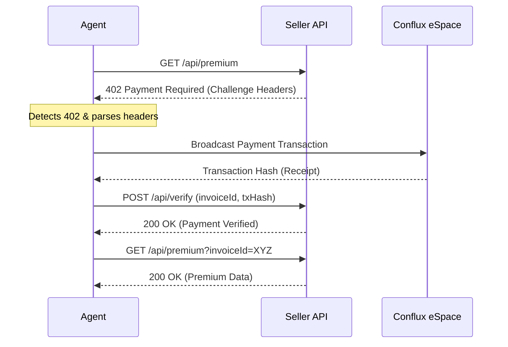

# x402 Full-Stack Boilerplate

An end-to-end reference for **x402 (Payment Required)** autonomous agent payments on Conflux eSpace.

## Objectives
1. **Seller API**: Enforce paywalls using HTTP 402 and standard headers.
2. **AI Agent**: Detect 402 responses, execute payments, and retry requests.
3. **Web UI**: Human-friendly interface for manual payments and monitoring.

## AI Agent Payment Flow

The core of the x402 protocol is a 4-step loop that allows agents to pay for resources without human intervention.



### Protocol Headers (Minimum Spec)
- `X-Payment-Amount`: Amount in wei (e.g., `100000000000000000`)
- `X-Payment-Token`: Token address (`0x0...0` for CFX)
- `X-Payment-Nonce`: Unique request nonce
- `X-Payment-Expiry`: Unix timestamp
- `X-Payment-Invoice-Id`: Ephemeral ID for tracking

## Getting Started

### 1. Install Dependencies
```bash
npm install
```

### 2. Run the Development Server
```bash
npm run dev
```
Open [http://localhost:3000](http://localhost:3000) to see the Web UI.

### 3. Test the Agent
The agent logic is located in `agent/agent.ts`. It demonstrates the autonomous discovery-payment-retry loop.

## Security Controls
- **Spending Caps**: Agents should be initialized with a maximum budget to prevent runaway costs.
- **Replay Protection**: The `X-Payment-Nonce` and `X-Payment-Expiry` headers ensure a payment cannot be reused for different requests.
- **Verification**: The seller must verify the transaction hash on-chain before releasing data.

## License
MIT
